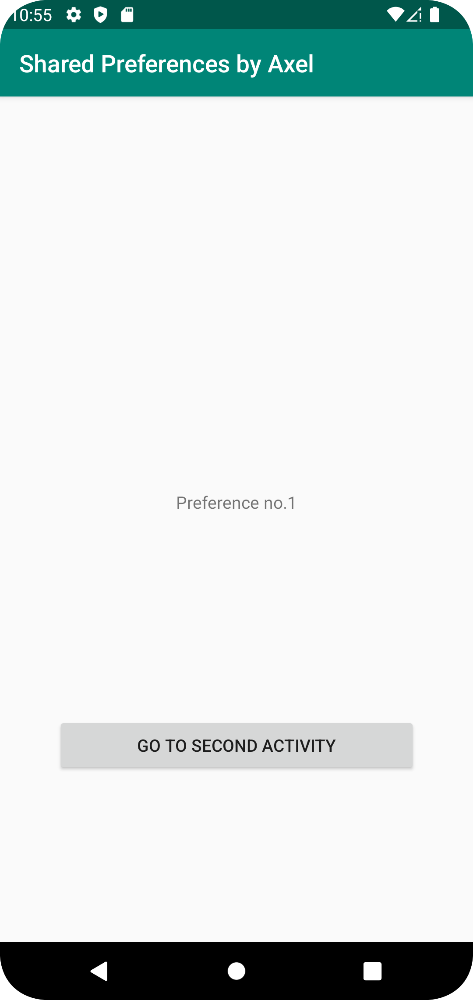
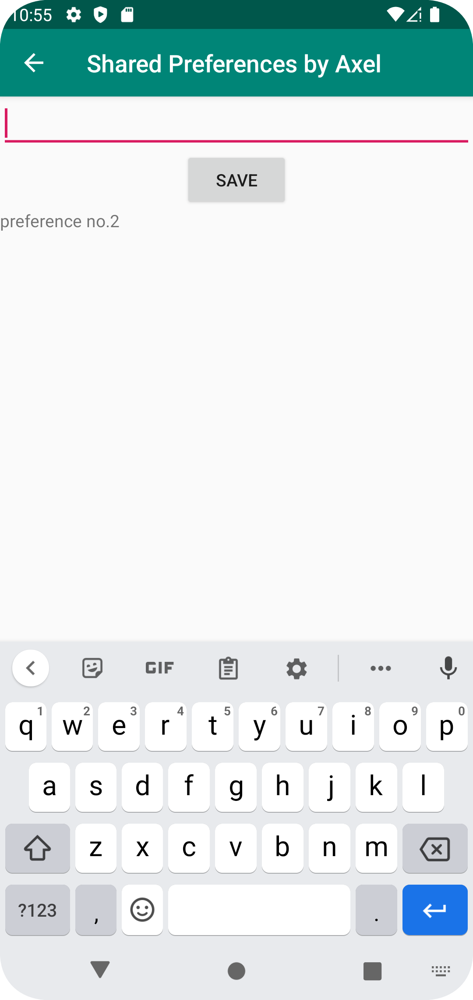

# Rapport

**Skriv din rapport här!**

Uppgiftens första steg innebar att läsa datan från shared preferences i mainactivity. Detta gjordes genom koden:
TextView prefTextRef=new TextView(this);
prefTextRef=(TextView)findViewById(R.id.prefText);
prefTextRef.setText(myPreferenceRef.getString("MyAppPreferenceString", "No preference found."));
Koden fanns i canvas guiden och behövde inte anpassas så mycket efter koden eftersom inte mycket var skrivet än. 
Efter detta var det dags att skapa en second activity. Detta gjordes genom att gå in på github och återvinna den kod
som skrevs i uppgiften "screens". Efter att detta var klart var det dags att skriva samt spara preferences i den nya aktiviteten.
Detta gjordes genom att skapa en edittext samt en button. Genom edittexten gik det att skriva den preferens som önskades och sedan klicka
på save knappen. När save knappen klickades kördes funktionen savePref() som ser ut på följande sätt:
public void savePref(View v){
        // Get the text
        EditText newPrefText=new EditText(this);
        newPrefText=(EditText)findViewById(R.id.settingseditview);
        // Store the new preference
        myPreferenceEditor.putString("MyAppPreferenceString", newPrefText.getText().toString());
        myPreferenceEditor.apply();
        // Display the new preference
        TextView prefTextRef=new TextView(this);
        prefTextRef=(TextView)findViewById(R.id.prefText1);
        prefTextRef.setText(myPreferenceRef.getString("MyAppPreferenceString", "No preference found."));
        // Clear the EditText
        newPrefText.setText("");
    }
Vad som händer i denna funktion är att den först hämtar texten i edittexten och sparar den text till en variabel
som heter newPrefText. Efter att texten blivit sparad genom preferenceeditorn till "MyAppPreferenceString". Preferensen blir sedan sparad
genom den funktionen apply(). Efter att preferensen sparats så visas den i en textview nedanför save knappen. om "MyAppPreferenceString"
är tom printas meddelandet "No preference found".Det sista som händer är att edittexten rensas genom att sätta texten till tom. 
För att texten sedan ska visas i mainactivity lades kodsnutt som tidigare nämndes för att läsa preferensen i en metod som heter
onResume(). Detta gjordes för att när mainavtivity återupptas läses preferenserna in igen till skillnad from metoden 
onCreate() osm bara läste in preferenserna när aktiviteten skapades. 
När appen var klar såg de två vyerna ut på följande sätt:


## Följande grundsyn gäller dugga-svar:

- Ett kortfattat svar är att föredra. Svar som är längre än en sida text (skärmdumpar och programkod exkluderat) är onödigt långt.
- Svaret skall ha minst en snutt programkod.
- Svaret skall inkludera en kort övergripande förklarande text som redogör för vad respektive snutt programkod gör eller som svarar på annan teorifråga.
- Svaret skall ha minst en skärmdump. Skärmdumpar skall illustrera exekvering av relevant programkod. Eventuell text i skärmdumpar måste vara läsbar.
- I de fall detta efterfrågas, dela upp delar av ditt svar i för- och nackdelar. Dina för- respektive nackdelar skall vara i form av punktlistor med kortare stycken (3-4 meningar).

Programkod ska se ut som exemplet nedan. Koden måste vara korrekt indenterad då den blir lättare att läsa vilket gör det lättare att hitta syntaktiska fel.

```
function errorCallback(error) {
    switch(error.code) {
        case error.PERMISSION_DENIED:
            // Geolocation API stöds inte, gör något
            break;
        case error.POSITION_UNAVAILABLE:
            // Misslyckat positionsanrop, gör något
            break;
        case error.UNKNOWN_ERROR:
            // Okänt fel, gör något
            break;
    }
}
```

Bilder läggs i samma mapp som markdown-filen.


Läs gärna:

- Boulos, M.N.K., Warren, J., Gong, J. & Yue, P. (2010) Web GIS in practice VIII: HTML5 and the canvas element for interactive online mapping. International journal of health geographics 9, 14. Shin, Y. &
- Wunsche, B.C. (2013) A smartphone-based golf simulation exercise game for supporting arthritis patients. 2013 28th International Conference of Image and Vision Computing New Zealand (IVCNZ), IEEE, pp. 459–464.
- Wohlin, C., Runeson, P., Höst, M., Ohlsson, M.C., Regnell, B., Wesslén, A. (2012) Experimentation in Software Engineering, Berlin, Heidelberg: Springer Berlin Heidelberg.
